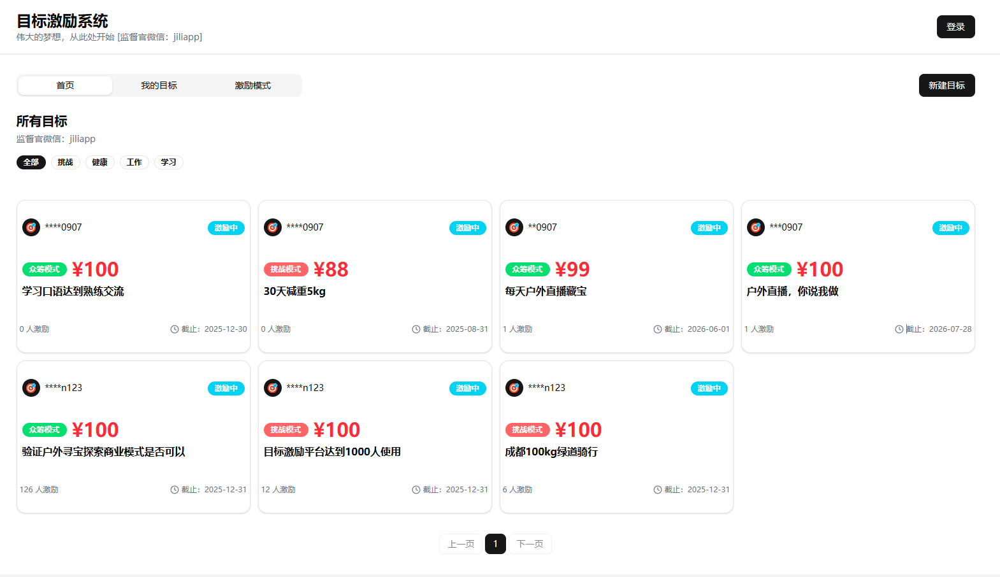

## 激励目标

```
反向激励-挑战模式(对赌模式)
正向激励-众筹模式
```

```
🔥 ​​你立过的 Flag ，这次一定实现！​​

总是三分钟热度？计划总被拖延打败？别担心，​​【目标激励站】​​ 帮你用「众筹」和「对赌」两大模式，彻底终结半途而废！

✨ ​​众筹激励：让全世界为你加油​​
公开目标，邀请朋友为你助力——每完成一个里程碑，收获大家的鼓励和奖励！💰
✅ 适合：需要外部监督的正向推动者

⚡ ​​对赌挑战：狠逼自己一把​​
押上承诺，设定惩罚规则——做不到就付出代价，看你还敢拖延！💪
✅ 适合：需要破釜沉舟的行动派

​​为什么选择我们？​​
✔ 科学目标拆解，告别盲目努力
✔ 双重激励模式，总有一种适合你
✔ 社群见证，拖延症不攻自破

​​🚀 现在开始，让目标「赌」赢未来！​​
👉 立即挑战

站点： https://gh.pages.laifuygj.com/

```

## 功能展示

### 首页


首页展示了应用的主要功能和特点，用户可以在这里了解"目标激励站"的两大核心模式：众筹激励和对赌挑战。页面设计简洁明了，突出了应用的价值主张，帮助用户快速理解产品的核心功能。

### 我的目标


我的目标页面展示用户当前正在进行的所有目标，包括进度追踪、里程碑完成情况以及激励机制的实时状态。用户可以在这里管理自己的目标，查看支持者留言，以及记录目标完成的证明。


### 模式选择


模式选择页面允许用户根据自己的需求和性格特点选择最适合的激励模式：
- **众筹激励模式**：适合需要外部监督和鼓励的用户，通过公开目标获取朋友支持
- **对赌挑战模式**：适合需要强力约束的用户，通过设定惩罚机制来确保目标完成


### 目标详情


目标详情页面提供了单个目标的完整信息和管理功能。用户可以在这里查看目标的详细描述、完成期限、激励方式和进度情况。该页面还允许用户更新目标进度、上传完成证明、与支持者互动，以及管理相关的激励或惩罚机制。目标详情页是用户日常使用最频繁的页面之一，它直观地展示了目标完成的全过程，帮助用户保持专注和动力。